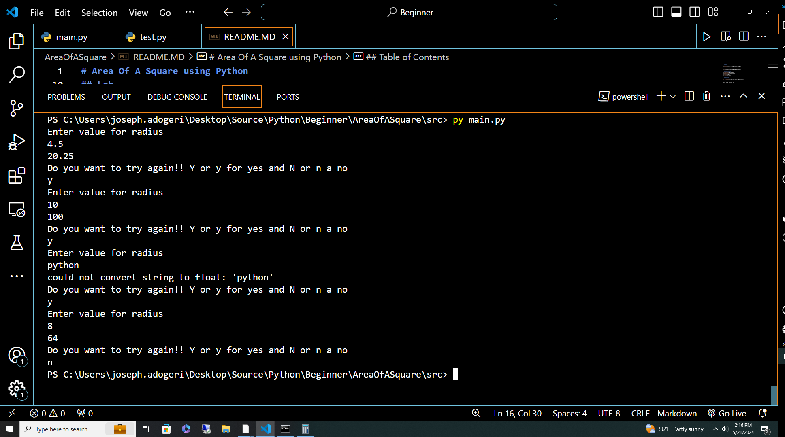
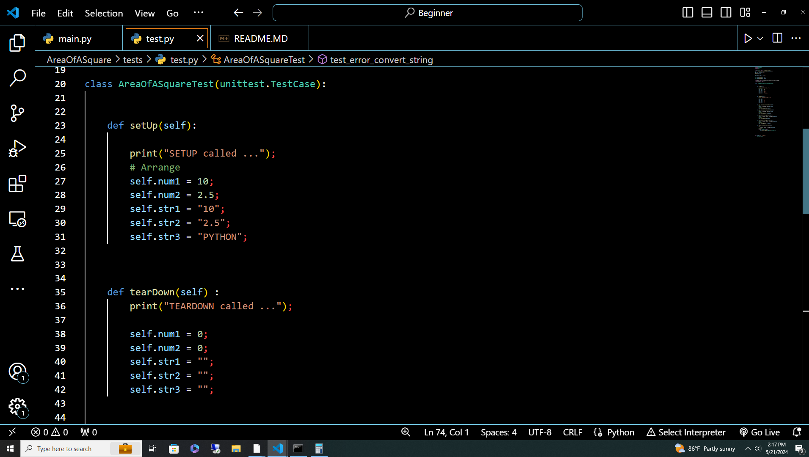
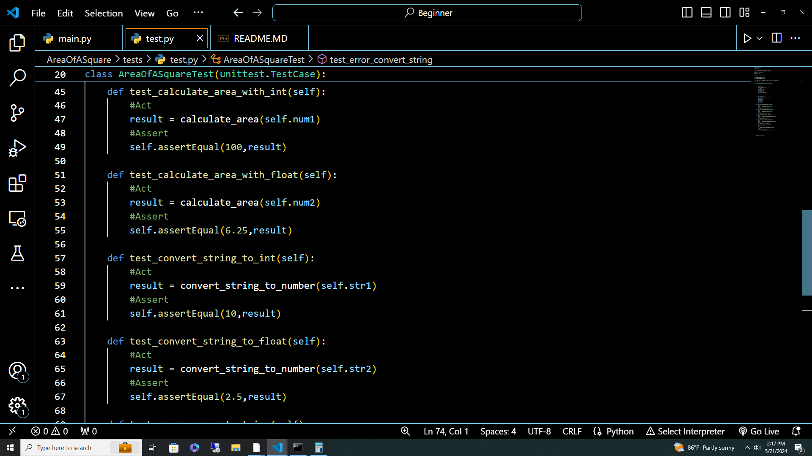
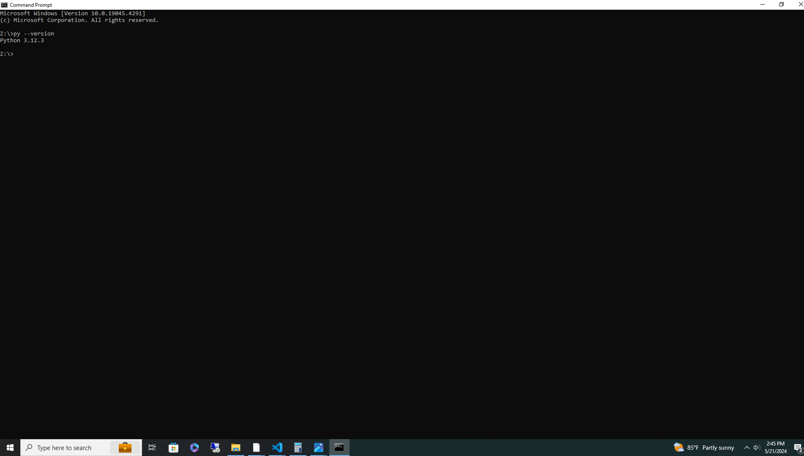
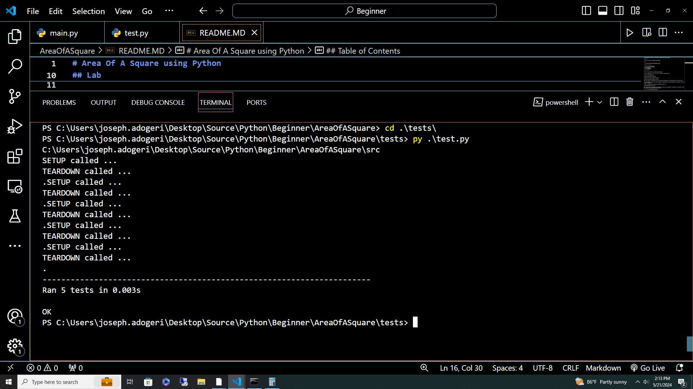

# Area Of A Square using Python

## Description
This app takes in float or int as radius, calculate the area of a square

## Authors

- [@jadogeri](https://www.github.com/jadogeri)

## Lab

-   

## Table of Contents

- [Screenshots](#screenshots)
- [Installation](#installation)
- [Usage](#usage)
    -[Run Locally](#run-locally)
- [Tests](#tests)
- [About me](#about-me)
- [License](#license)
- [Credits](#credits)

## Screenshots

|    |   |                 
|  | 

## Installation

[### For Windows](https://www.python.org/downloads/)

1 Type in address bar [https://www.python.org](https://www.python.org/).

2 Click on the downloads tab.

3 Choose windows operating system.

4 Select the version of python to install.

5 Dowload the python executable installer.

6 Run the installer. Note! Make sure to select both the checkboxes at the bottom and then click Install New.

7 The installation process will take few minutes to complete and once the installation is successful, the following screen is displayed.

8 Open the command prompt by typing into windows searchbar cmd.

9 Type Py --version and press enter.

```bash
  py --version
```


Note! The version of the python which you have installed will be displayed if the python is successfully installed on your windows.The output produced as shown below.



## Usage

### Run Locally

#### Get Project 
1 Open command line or terminal.

2 Type command git clone https://github.com/jadogeri/Python.git then press enter.

```bash
  git clone https://github.com/jadogeri/Python.git
```

3 Enter command cd Python then press enter.

```bash
  cd Python
```

4 Navigate to project src folder entering command cd Beginner/AreaOfASquare/src.

```bash
  cd /Beginner/AreaOfASquare/src
```

5 Type py main.py to run program.

```bash
  py main.py
```
## Tests

1 Open command line or terminal.

2 Navigate to project folder AreaOfASquare.

3 Type cd tests then press enter to navigate to the tests directory.

```bash
  cd tests
```

4 Type python test.py or py test.py then press enter.

```bash
  py test.py
```

5 The terminal produces output as shown below.



## About Me  
🚀
I'm a Database Programmer learning Python to build mobile, web and cloud applications.


## License

[LICENSE](/LICENSE)

## Credits

An Insightful Techie : [Unit Testing in Python using unittest framework - Basic Introduction and How to Write Tests](https://www.youtube.com/watch?v=HKTyOUx9Wf4&t=363s).

Caleb Curry : [Python Programming 53 - Sys.path and Changing Module Paths](https://www.youtube.com/watch?v=5z5nALNandM).

FreeCodeCamp : [Learn Python - Full Course for Beginners [Tutorial]](https://www.youtube.com/watch?v=rfscVS0vtbw).

