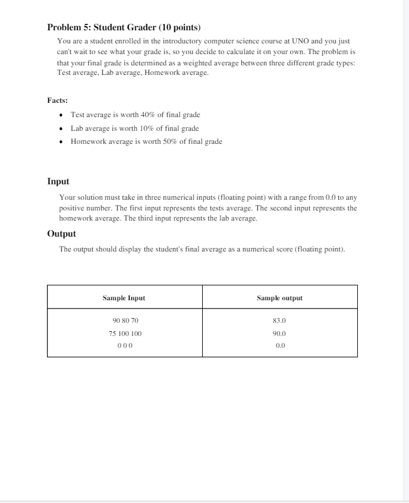
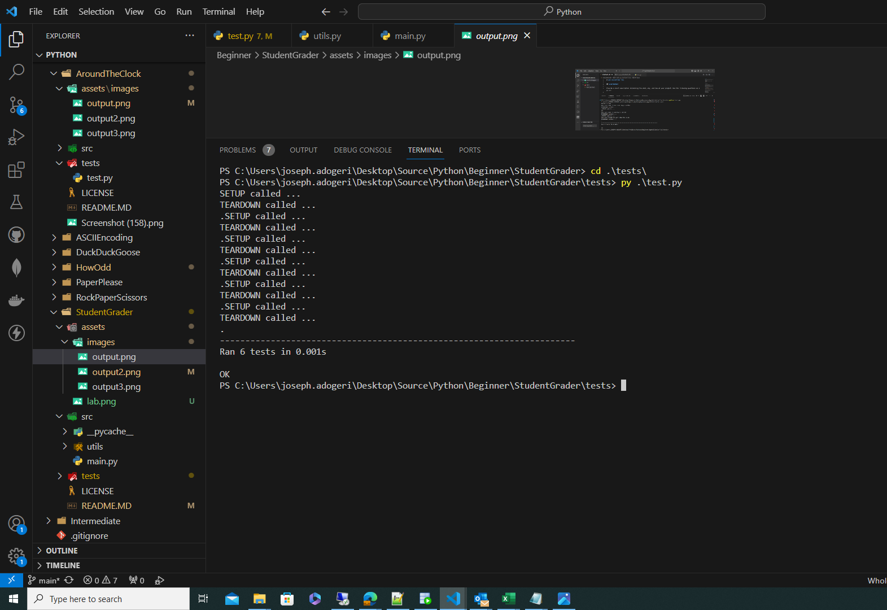

# STUDENT GRADER

## Description

My motivation for this project is to solve problems in python. I built this project to utilize the basic concepts of python. This project validates userscores (only numbers as input) checking if user was allowed to carry out different activities. This project taught me to write simple unit tests, read user inputs and import multiple modules.

## Authors

- [@jadogeri](https://www.github.com/jadogeri)

## Lab

-  

## Table of Contents

- [Installation](#installation)
- [Usage](#usage)
- [Tests](#tests)
- [About me](#about-me)
- [License](#license)
- [Credits](#credits)

## Installation

### For Windows

1 Type in address bar [https://www.python.org](https://www.python.org/).

2 Click on the downloads tab.

3 Choose windows operating system.

4 Select the version of python to install.

5 Dowload the python executable installer.

6 Run the installer. Note! Make sure to select both the checkboxes at the bottom and then click Install New.

7 The installation process will take few minutes to complete and once the installation is successful, the following screen is displayed.

8 Open the command prompt by typing into windows searbar cmd.

9 Type ‘python’ and press enter.

Note! The version of the python which you have installed will be displayed if the python is successfully installed on your windows.The output produced as shown below.


## Usage

1 Open command line or terminal.

2 Type command git clone https://github.com/jadogeri/Python.git then press enter.

3 Enter command cd Python then press enter.

4 Navigate to project src folder entering command cd Beginner/StudentGrader/src.

5 Type python main.py or py main.py then press enter.

6 The terminal produces output as shown below.

.

## Tests

1 Open command line or terminal.

2 Navigate to project folder AreaOfASquare.

3 Type cd tests then press enter to navigate to the tests directory.

```bash
  cd tests
```

4 Type python test.py or py test.py then press enter.

```bash
  py test.py
```

5 The terminal produces output as shown below.



## About Me  
🚀
I'm a Database Programmer learning Python to build mobile, web and cloud applications.


## License

[LICENSE](/LICENSE)

## Credits

An Insightful Techie : [Unit Testing in Python using unittest framework - Basic Introduction and How to Write Tests](https://www.youtube.com/watch?v=HKTyOUx9Wf4&t=363s).

Caleb Curry : [Python Programming 53 - Sys.path and Changing Module Paths](https://www.youtube.com/watch?v=5z5nALNandM).

FreeCodeCamp : [Learn Python - Full Course for Beginners [Tutorial]](https://www.youtube.com/watch?v=rfscVS0vtbw).

